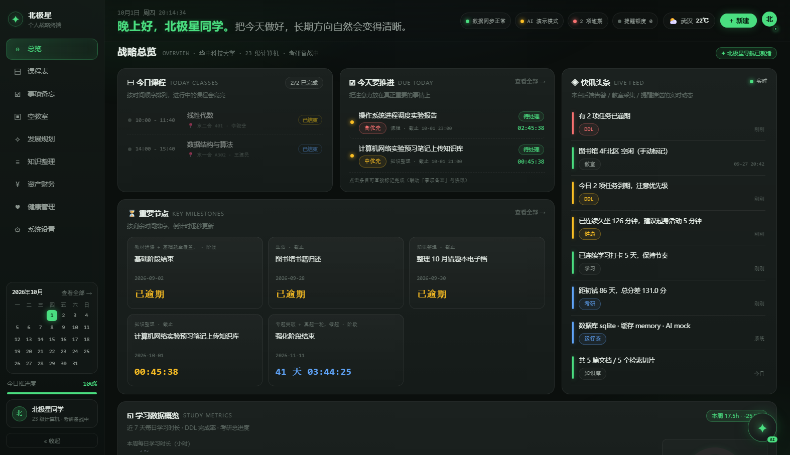

# 北极星 · 个人战略终端（Web 管理端）

Vue 3 + Vite + Naive UI + ECharts · 深色极客风（#121212 / #4ade80）· **已接入 `polaris-backend` 真实接口**（登录鉴权 + 9 模块实时数据 + 真 AI 对话）。

## 启动步骤

> 先启动后端（见 [../polaris-backend/README.md](../polaris-backend/README.md) 或 [../docs/落地部署手册.md](../docs/落地部署手册.md)）

```bash
# ① 后端（另一个终端）
cd ../polaris-backend
.venv\Scripts\python.exe scripts\init_db.py --seed        # 首次：建表 + 演示数据（admin/admin123）
.venv\Scripts\python.exe -m uvicorn app.main:app --reload --port 8000

# ② 前端
cd ../polaris-terminal
npm install          # 或 pnpm install（pnpm v10 首次需信任构建脚本，仓库已内置 pnpm-workspace.yaml）
npm run dev          # → http://localhost:5200
npm run build        # 生产构建，产物 dist/
```

登录：**admin / admin123**（后端演示账号；与微信小程序共用同一后端，登录同一账号即双端同步）

前端通过 vite 代理访问后端：`/api`、`/uploads`、`/health` → `http://127.0.0.1:8000`。
如需直连其它后端，设置环境变量 `VITE_API_BASE=http://your-host:8000/api/v1` 后启动。

## 已实现

- **认证**：登录 / 注册页 + JWT 持久化（localStorage）+ 路由守卫 + 401 自动登出；顶栏头像菜单可退出登录
- **布局**：左侧固定导航 200px（可折叠 64px）· 顶部状态栏（logo + 问候语/实时时钟 + **真实运行态标签**/天气/新建/头像）· 卡片流式主区 · 右下角常驻 AI 助手（拖拽 / 最小化 / **真实 SSE 流式对话**）
- **9 个路由页**：总览、课程表、事项备忘、空教室、考研规划、知识整理、资产财务、健康管理、系统设置
- **数据来源（全部真实接口）**：
  - 总览 6 卡片 ← `/dashboard/summary`（课程/任务/学习/考研/知识/健康/教室/提醒一次聚合）
  - 课程表 ← `/courses/week`；事项备忘 ← `/tasks`、`/tasks/stats`（**新建 / 勾选完成 / 取消完成均写后端**）
  - 空教室 ← `/classroom/buildings`、`/classroom/free-rate`、`/classroom/predict`、`/classroom/status/recent`
  - 考研规划 ← `/kaoyan/plans`、`/kaoyan/gap-analysis`、`/kaoyan/plan/tasks`（勾选写回后端）、**一键重新生成计划调 DeepSeek**
  - 知识整理 ← `/knowledge/stats`、`/knowledge/docs`、`/knowledge/qa`（**真实 RAG 问答 + 引用来源**）
  - 资产财务 ← `/finance/summary|trend|budgets|records`；健康 ← `/health/report|settings|records`、**久坐心跳与起身重置**
  - 系统设置 ← `/system/runtime`（运行态/版本）、`/system/backups`（**一键数据备份**）、主题色写回用户配置
  - AI 助手 ← `/ai/chat/stream`（SSE：`meta → tool* → token* → done`，**工具调用过程可视化**，回复后自动刷新看板）
- **设计规范（参照「个人战略中枢」参考稿微调）**：
  - 底色 **#0b0f0d** 深墨绿黑 + 三处柔光晕（左上/右下绿色 `radial-gradient`、顶部淡蓝），面板 **#131917** 带 1px `rgba(255,255,255,.075)` 描边、圆角 **16px**、内层微妙渐变
  - 强调色 **#4ade80**；数字/时间统一等宽字体 + `tabular-nums`；正向绿、负向/逾期红 `#f87171`、警示黄 `#fbbf24`
  - 文字三级 **#e7efe9 / #98a29c / #5e6a64**；卡片标题下一行小灰副标题（如「把注意力放在真正重要的事情上」）；右侧「查看全部 →」灰色动作链接
  - 顶栏：小号日期时间 + **大号荧光绿问候语**（含姓名与战略口号），右侧状态药丸（同步/AI/逾期/提醒额度）、天气、绿色胶囊「＋ 新建」、头像
  - 侧栏：品牌区在顶部（✦ 北极星 / 个人战略终端）→ 圆角高亮菜单 → 底部**迷你日历**（今日高亮）、今日推进度、用户卡、收起按钮
  - 重要节点：**卡片网格**（来源 · 类型 / 标题 / 日期 / 大号倒计时）
  - AI 助手：半透明毛玻璃面板，AI 回复**无气泡**纯文本、用户消息右侧浅色气泡、底部胶囊输入 + 绿色「发送」，工具调用显示为 `⚙ 工具名` 小药丸

## 运行验证结果

| 检查项 | 方式 | 结果 |
| --- | --- | --- |
| 生产构建 | `npm run build` | ✓ built，登录页 + 9 视图 + 组件全部编译 |
| 开发服务 | `npm run dev` → :5200 | ✓ 200 |
| 模块转换 | `node scripts/probe-dev.cjs` | ✓ `ALL_MODULES_OK` |
| 代理联调 | 经 :5200 代理请求 `/health`、登录、`/dashboard/summary` 等 **22 个接口** | ✓ 全部 200 |
| 真实渲染 | `node scripts/capture.mjs`（headless 浏览器**真实登录**后逐页截图 + DOM 校验） | ✓ `docs/shot-*.png`，看板显示真实课程/任务倒计时/逾期提醒/学习时长 |

实测截图（真实后端数据）：总览 `docs/shot-dashboard.png`、事项备忘、考研、财务、健康、设置等共 9 张。

> 提示：`scripts/capture.mjs` 需要本机有 Edge/Chrome，且后端与前端都在运行；它先调用 `/auth/login` 拿 token，
> 再通过 CDP 注入 localStorage 完成「已登录」状态，最后逐页截图并打印页面文本，用于自动化验收。



## 目录结构

```
polaris-terminal/
├── index.html / vite.config.js / package.json
├── scripts/probe-dev.cjs        # dev 服务器模块可访问性自检
├── scripts/capture.mjs          # 真实登录 + 逐页截图验收（CDP）
├── docs/shot-*.png              # 验收截图（真实后端数据）
└── src/
    ├── main.js / App.vue         # 启动引导：连接后端 → 登录守卫 → 全局错误条
    ├── theme/polaris.js          # Naive UI 暗色主题覆盖
    ├── styles/global.css         # 设计令牌 + 全局样式
    ├── router/index.js           # 登录 + 9 路由（懒加载 + 登录守卫）
    ├── api/http.js               # fetch 封装：JWT、统一错误、401 登出、SSE 解析
    ├── api/index.js              # 13 组接口（auth/dashboard/courses/tasks/classroom/
    │                             #   study/kaoyan/knowledge/finance/health/system/ai/wechat）
    ├── store/index.js            # 真实数据适配器：接口 → 视图结构 + 全部写操作
    ├── mock/data.js              # （保留）原型参考数据，当前不再使用
    ├── utils/{format,chart}.js   # 时间/倒计时 · ECharts 辉光封装
    ├── components/
    │   ├── AppLayout.vue / SideNav.vue / TopBar.vue
    │   ├── GlowChart.vue / StatusDot.vue
    │   └── AiAssistant.vue       # 悬浮窗（拖拽/最小化/**SSE 流式对话 + 工具轨迹**）
    └── views/                    # LoginView + Dashboard + 8 模块页
```

## 各页面要点

- **登录 / 注册**：深色终端风格，登录后 token 落地 localStorage；401 自动跳回登录页
- **总览**：6 张卡片全部来自 `/dashboard/summary`，DDL 可点击直接完成（写后端）并联动快讯
- **课程表**：7×14 时间网格，课程块绝对定位 + 冲突检测清单 + 课程清单（数据来自 `/courses/week`）
- **事项备忘**：筛选（全部/待推进/今日/逾期/已完成）、勾选完成/取消、新建弹窗、完成趋势与分类占比
- **空教室**：空闲率热力图、预测横向条形图 + 推荐列表、采集记录（含 AI 识图来源标记）
- **考研规划**：目标院校卡 + 初试倒计时、分数差距对比图与科目进度条、阶段推进、每日任务勾选写回、一键重新生成计划（DeepSeek）
- **知识整理**：文档库（索引完成度）、**真实 RAG 问答面板（含引用来源与模式）**、分类字数占比、入库节奏
- **资产财务**：收支/结余/学习投入占比、支出结构饼图、6 个月趋势、预算执行条、流水明细
- **健康管理**：久坐提醒横幅（起身即重置后端计时）、作息与运动趋势双图、饮水进度、快速记录（写 `/health/records`）、健康建议
- **系统设置**：主题强调色（写回用户配置）、侧栏折叠、天气城市、**运行态与数据源**、**一键数据备份**、快捷键

## 与小程序的关系

两端共用同一后端与账号体系：Web 端负责深度管理与分析，小程序负责随手查询与采集（拍照上报教室、快速记 DDL、打卡）。
登录同一账号（Web 用 admin/admin123，小程序「我的」页也填同一账号）即可看到同一份数据。

